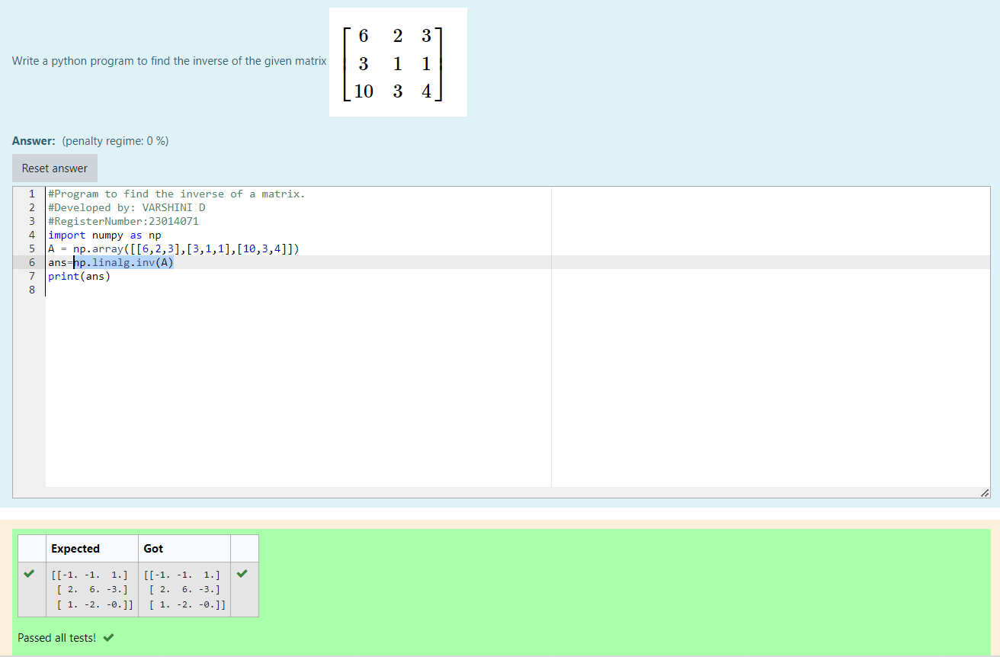

# INVERSE-OF-A-MATRIX
## Aim:
To write a python program to find the inverse of a matrix
## Equipment’s required:
1. 	Hardware – PCs
2. 	Anaconda – Python 3.7 Installation / Moodle-Code Runner
## Algorithm:
### Step1 : Import the numpy to use built-in functions for calculations.
### Step 2: Assign np.array()
### Step 3: Using np.linalg.inv(A) we can find the solution
### Step 4: End the program.

## Program:
```
#Program to find the inverse of a matrix.
#Developed by: VARSHINI D
#RegisterNumber:23014071
import numpy as np
A = np.array([[6,2,3],[3,1,1],[10,3,4]])
ans=np.linalg.inv(A)
print(ans)

```
## Output:


## Result:
Thus the inverse of given matrix is successfully solved using python program.

